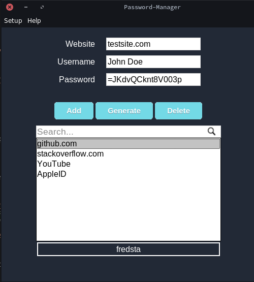
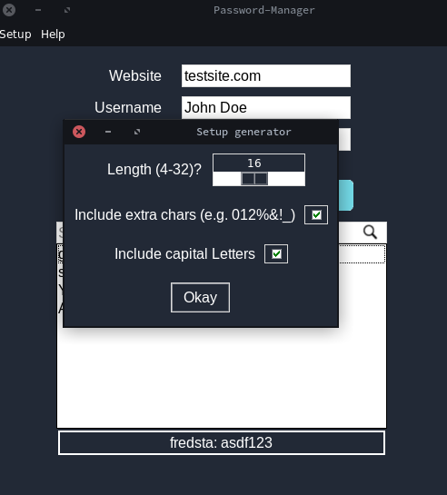

# Passwordmanager
Passwordmanager with included generator built in python using tkinter.

## General look and feel

- save any kind of password you want to
- if one clicks on the website in the listbox, the matching username
will be shown and the password will automatically be copied to your
clipboard for the time the program's running
- included passwordgenerator

The generator is more or less fully configurable as
one can see below.

### there's also a search-mode included

## technical facts
- written in python only (tkinter for the gui)
- all of the data is stored in an encrypted way (using fernet)

## How to use
The program should explain the most by itself.
Nevertheless feel free to ask me if you got any trouble.